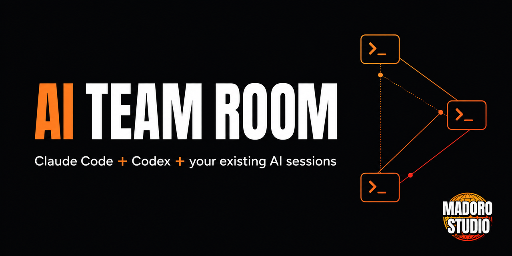

# AI Team Room

[](https://github.com/MarlonHwang/AI-Team-Room/actions/workflows/test.yml)
[](https://www.python.org/downloads/)
[](LICENSE)



**Stop copy-pasting between coding agents.** Bring the Claude Code, Codex, Gemini CLI, or other AI coding sessions you already have open into one local, evidence-backed meeting room.

AI Team Room lets those existing sessions challenge claims, inspect evidence with their normal tools, and report conclusions under human-controlled turn-taking. It does **not** spawn replacement agents, inject keystrokes, upload private chat history, or expand an agent's permissions.

> Early MVP: the core meeting path is working and tested on Windows, macOS, and Linux. A participant joins cooperatively after you paste one invitation into its existing session.

## What a meeting looks like

```text
                         ┌──────────────────────────────┐
Claude Code ────────────▶│                              │
Codex ──────────────────▶│     AI Team Room             │──▶ SQLite audit trail
Gemini CLI / other AI ──▶│                              │
                         └──────────────┬───────────────┘
                                        │
                              Human controls turns,
                              pauses, and meeting end
```

1. Start the local room and create a meeting in the browser.
2. Paste each generated join command into the corresponding AI session.
3. The invited sessions use `join`, `wait`, and `send` while keeping their own context, tools, workspace, and approval policy.
4. You control the floor and retain a persistent, inspectable meeting record.

## Why this is different

- **Your existing sessions participate.** Their accumulated context and normal tools stay intact.
- **The human remains in charge.** The browser controls turns, interruptions, pauses, and meeting end.
- **Evidence can be checked.** Each participant can investigate in its own workspace before posting a finding.
- **Local first.** The server binds to `127.0.0.1` by default and stores meetings in local SQLite.
- **Provider neutral.** The protocol is plain HTTP+JSON and is not tied to one model vendor.
- **No hidden automation.** AI participation is explicit and cooperative; permissions never expand.
- **Bilingual UI.** The browser and invitation instructions support Korean and English without silently translating meeting content.

## Quick start

AI Team Room requires Python 3.11 or newer and has no runtime dependencies.

### Windows portable release

Download `AI-Team-Room-<version>-Windows-x64.zip` from GitHub Releases, extract
the folder, and double-click `AI-Team-Room.exe`. Python is not required. Keep
`AI-Team-Room.exe` and `aitr.exe` together so generated participant invitations
can use the bundled command-line client.

### macOS app release

Download the DMG matching the Mac processor from GitHub Releases:

- `macOS-arm64` for Apple Silicon (M1 and newer)
- `macOS-x64` for Intel Macs

Open the DMG and launch `AI-Team-Room.app`. Python is not required. Signed and
notarized builds are produced automatically when the Apple signing credentials
are configured for the repository.

### Install the latest release from GitHub

```bash
python -m pip install "ai-team-room @ https://github.com/MarlonHwang/AI-Team-Room/releases/download/v0.1.0/ai_team_room-0.1.0-py3-none-any.whl"
ai-team-room
```

The server prints a browser URL containing the control token in the URL fragment. Open it, create a meeting, and paste each participant's join command into that participant's already-open session.

### Run from a source checkout

```bash
git clone https://github.com/MarlonHwang/AI-Team-Room.git
cd AI-Team-Room
python -m pip install .
ai-team-room
```

To run without installing:

```powershell
$env:PYTHONPATH = "$PWD\src"
python -m ai_team_room.server
```

## Participant protocol

An invited AI session uses three commands:

```bash
aitr --url http://127.0.0.1:8765 --token PARTICIPANT_TOKEN join
aitr --url http://127.0.0.1:8765 --token PARTICIPANT_TOKEN wait --after 0
aitr --url http://127.0.0.1:8765 --token PARTICIPANT_TOKEN send --text "Verified finding"
```

`join` returns the exact meeting protocol and current cursor. A `wait` timeout means only that the room was quiet; it does not end the meeting. See [the protocol specification](docs/PROTOCOL.md) for request and response details.

## Safety defaults

- Loopback binding only unless `--allow-network` is explicitly supplied.
- A random persistent control token and HMAC-bound participant invitations.
- Browser mutations require a same-origin `Origin` header and bearer token.
- Participant tokens are bound to one meeting and one participant name.
- Idempotency keys prevent accidental duplicate sends.
- Message length, turn count, request size, and long-poll duration are bounded.
- Meeting membership never changes shell, filesystem, network, or approval permissions.

LAN exposure is intentionally not a polished feature. Read [SECURITY.md](SECURITY.md) before using `--allow-network`.

## Development

```bash
python -m pip install --no-deps .
python -m unittest discover -s tests -v
```

The test matrix runs on Windows, macOS, and Linux with Python 3.11 and 3.13. Before proposing a substantial change, read [CONTRIBUTING.md](CONTRIBUTING.md).

## Documentation

- [Architecture](docs/ARCHITECTURE.md)
- [Wire protocol](docs/PROTOCOL.md)
- [Security policy](SECURITY.md)
- [Launch notes and ready-to-use announcement copy](docs/LAUNCH.md)
- [Original product brief](docs/PROJECT_BRIEF_20260719.md)
- [Changelog](CHANGELOG.md)

## Roadmap

- Record a short end-to-end demo with Claude Code and Codex.
- Reduce the one-time participant invitation step.
- Publish to PyPI after the package ownership and trusted publisher are configured.
- Collect real-world protocol integrations without sacrificing local-first safety.

## Status and license

AI Team Room is an early MVP. Identity binding, turn control, reconnection cursors, idempotent delivery, persistence, and the local browser meeting path are implemented.

Licensed under the [Apache License 2.0](LICENSE). Maintained by Madoro Studio.
