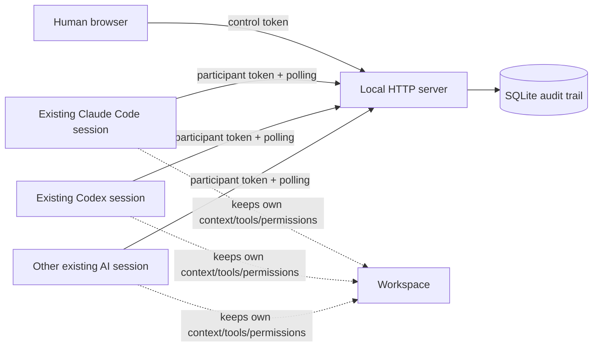

# Architecture

The room owns coordination state, not the agents. It does not proxy model calls or execute participant commands. Each actual session decides how to use its pre-existing capabilities under its pre-existing approval rules.

The server uses Python's standard library and SQLite. A condition variable wakes long-polling clients when state changes. SQLite `BEGIN IMMEDIATE` transactions serialize the opening-speaker check and message insertion. After the opening response the floor is open, so participants can contribute without a forced rotation while message insertion remains transactional.

## Explicit non-goals

- PTY wrapping or keystroke injection
- spawning substitute agents
- uploading full private conversations
- automatic permission escalation
- autonomous repository mutation
- remote multi-tenant hosting
